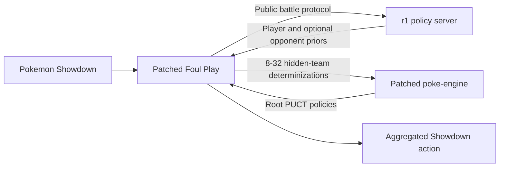

# Metagross

**Learned policy guidance for imperfect-information Pokemon search.**


[Overview](#overview) | [Architecture](#architecture) | [Accepted r1](#accepted-r1) | [Getting started](#getting-started) | [Repository](#repository)

## Overview

Metagross is a hybrid learned-search research agent for Pokemon Showdown
`gen9randombattle`. It connects a fine-tuned 142M-parameter
[Metamon](https://github.com/UT-Austin-RPL/metamon) policy to a patched
[Foul Play](https://github.com/pmariglia/foul-play) and
[poke-engine](https://github.com/pmariglia/poke-engine) search stack.

Rather than asking the neural policy to play alone, Metagross uses its action
distribution to guide root-only PUCT searches through many plausible hidden
teams. Foul Play models the incomplete information, poke-engine simulates each
world, and the policy contributes strategic player and modeled-opponent priors.

### Highlights

- **Learned search guidance:** turns a 13-action policy into root priors for a
  Rust MCTS engine instead of replacing search with direct policy play.
- **Imperfect-information reasoning:** searches 8-32 adaptive hidden-team
  determinizations and combines their world-level policies.
- **Two-sided roots:** requires player priors and uses opponent priors whenever
  the corrected opponent-view adapter can construct them.
- **Operational integration:** includes live Showdown protocol tracking, policy
  serving, health checks, process ownership, and fail-closed player guidance.
- **Auditable research history:** preserves training, evaluation, failed gates,
  candidate agents, and later research branches under `experimental/`.

## Architecture



The accepted runtime consists of two Python processes and the patched Rust
engine:

1. [`prior_server.py`](srcs/metagross/prior_server.py) tracks live protocol
   sessions, builds Metamon observations, evaluates the r1 policy, and maps its
   output to engine actions.
2. [`run_foul_play.py`](srcs/metagross/run_foul_play.py) samples plausible
   worlds, requests priors before search, and injects them into each root.
3. [`launch.py`](srcs/metagross/launch.py) freezes the accepted configuration,
   starts both processes, waits for health, and owns their shutdown lifecycle.

See [`docs/architecture.md`](docs/architecture.md) for the full search contract.

## Accepted r1

| Component | Frozen value |
|---|---|
| Format | `gen9randombattle` |
| Policy | `randbats_exit_r1`, epoch 5, 142,832,563 parameters |
| Search | Root-only PUCT over Foul Play determinizations |
| Engine duration | 500 ms per world; 250 ms in selected early positions |
| Hidden-team sampling | 8-32 adaptive worlds across 8 workers |
| Engine threads | 1 per world |
| PUCT coefficient | `c_puct=2.0` |
| Player guidance | Required |
| Opponent guidance | Best effort |
| Runtime | [`srcs/metagross/`](srcs/metagross/) |

The `metaexitr1` public-ladder deployment was observed at a settled
**92.4-92.7 GXE at RD 25**, with a peak observed GXE of **93.6**. The previous
project result was 91.4 GXE.

> [!NOTE]
> This is a historical public-ladder observation, not a controlled paired H2H
> estimate. The run predates the later formal promotion protocol, and no single
> immutable final ladder snapshot was retained. See the
> [accepted result](results/accepted-r1/README.md) and
> [provenance notes](docs/provenance.md) for the evidence boundaries.

## Getting started

### Requirements

- Python 3.11
- Rust toolchain and a C compiler
- Git
- Enough memory for the policy and parallel search workers
- The accepted r1 checkpoint and Metamon base assets

Follow [`docs/setup.md`](docs/setup.md) to clone the pinned Foul Play and Metamon
revisions, apply their compatibility patches, build the Gen 9 engine, and create
the two Python environments.

> [!IMPORTANT]
> The accepted checkpoint is a 545 MiB external artifact and is not committed to
> Git. This repository does not publish a download location. Place an authorized
> copy at
> `srcs/models/randbats_exit_r1/ckpts/policy_weights/policy_epoch_5.pt` and verify
> SHA-256 `c6a4c0f571b8066e7471727dc82598e3a825256ec5391fab4ea55a6f16781d93`.

### Run the accepted agent

```bash
unset METAGROSS_VALUE_MODEL METAGROSS_PRIOR_DUMP METAGROSS_PRIOR_NAMESPACE
export METAGROSS_SHOWDOWN_PASSWORD='...'

.venv-metamon/bin/python -m srcs.metagross.launch \
  --username YOUR_SHOWDOWN_ACCOUNT \
  --games 200
```

The launcher starts the policy server, waits for `GET /health`, and then starts
the ladder client. The current runtime stops rather than intentionally falling
back to unguided search when required player priors are unavailable. Opponent
prior failures degrade to player-only guidance.

Check the server during a run with:

```bash
curl http://127.0.0.1:8977/health
```

See [`docs/operations.md`](docs/operations.md) for runtime invariants, shutdown,
and diagnostics.

## Repository

| Path | Purpose |
|---|---|
| [`srcs/metagross/`](srcs/metagross/) | Accepted launcher, policy server, and Foul Play adapter |
| [`srcs/vendor/poke-engine/`](srcs/vendor/poke-engine/) | Versioned patched engine source and recovered Linux wheel |
| [`srcs/patches/`](srcs/patches/) | Foul Play, Metamon, and root-prior compatibility patches |
| [`docs/`](docs/README.md) | Architecture, setup, operations, and provenance |
| [`results/`](results/README.md) | Curated accepted-r1 result and artifact manifests |
| [`experimental/`](experimental/README.md) | Historical research workspace and non-production candidates |

### Research program

The accepted runtime is intentionally small, but it is the outcome of a much
larger research program. The archive includes self-play and expert-iteration
tooling, policy distillation, learned leaf values, action-conditioned beliefs,
shared-root solvers, selective re-solving, evaluation gates, and unsuccessful
successor candidates. None of those branches superseded r1; their outcomes are
retained in the [`iteration log`](experimental/runs/iteration_log.md).

> [!WARNING]
> `experimental/` is an archive, not a supported runtime. Historical scripts may
> depend on old paths, external datasets, checkpoints, or environments and may
> not run directly from their current location.

## Documentation

- [Architecture](docs/architecture.md): policy serving and the search contract.
- [Setup](docs/setup.md): pinned dependencies, environments, and checkpoint.
- [Operations](docs/operations.md): launch, health, shutdown, and diagnostics.
- [Provenance](docs/provenance.md): versions, verification, and result caveats.
- [Accepted result](results/accepted-r1/README.md): curated metrics and evidence.
- [Artifact manifest](results/accepted-r1/artifacts.json): expected paths and
  SHA-256 digests.

Metagross is an accepted research artifact, not a hosted service or a claim of
state-of-the-art performance across all Pokemon agents.
