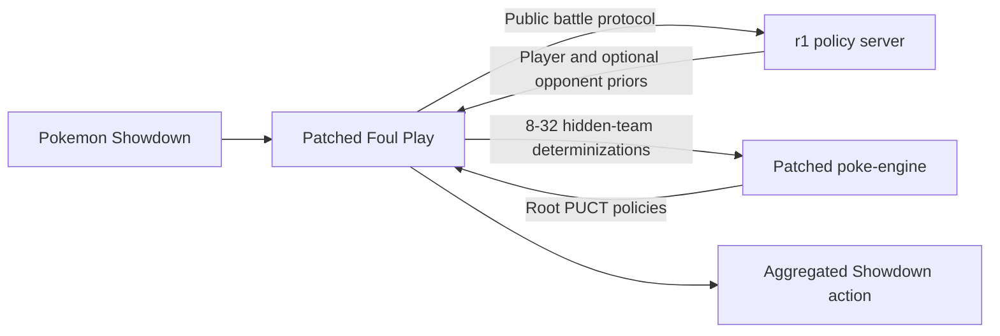
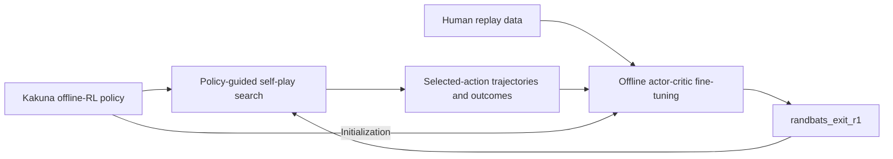

# Metagross

Metagross is a reinforcement-learning and imperfect-information-search agent for Pokemon Showdown `gen9randombattle`: a 142M-parameter offline-RL policy guiding determinized root-PUCT search in a patched Rust engine.


[Results](#results) | [Why this exists](#why-this-exists) | [Architecture](#architecture) | [Learning](#reinforcement-learning-and-expert-iteration) | [What was measured](#what-the-measurement-campaign-established) | [Getting started](#getting-started) | [Repository](#repository)

## Results

Public-ladder performance, measured to a fixed convergence standard (Glicko-1
RD ≤ 25, fresh registered accounts, deterministic 472k-iteration search
budgets). The two serving modes differ in exactly one variable — whether the
policy prior is conditioned on the battle history (`causal-history`) or only
the current state (`legacy-stateless`):

| Serving mode | Account | Record | GXE | Glicko ± RD |
|---|---|---|---|---|
| causal-history (deployed) | fresh, 2026-08 | 149-81 | **89.4** | 1902 ± 25.0 |
| legacy-stateless | fresh, 2026-08 | 174-83 | **91.7** | 1952 ± 25.0 |
| causal-history (frozen r1 reference) | 2026-08 | 141-85 | 86.6 | 1851 ± 25 |
| legacy-stateless (historical era) | 2026 | — | 92.4–92.7 | RD 25 |

Three findings the table encodes:

- **The historical 92.4 GXE reproduces.** A fresh stateless run converged at
  91.7 — within 0.7 of the legacy number, on a different account, months later.
- **The two serving modes are near-parity.** Stateless holds a ~2 GXE
  population-level edge; a direct 200-game mirrored head-to-head between the
  modes measured 48% — statistical parity.
- **Late-game prior overconfidence is real and partially fixable.** The causal
  prior's entropy collapses from ~0.96 to ~0.58 nats by turn 30+ (measured
  offline, replicated independently in cloud games). An entropy-matched
  temperature schedule applied at serving time scored **111-89 (55.5%,
  CI95 [48.6, 62.2])** against the stateless champion in a 200-game mirrored
  screen — a ~7-point recovery over the plain-causal baseline in the same
  matchup.

Peak historical observation: **93.6 GXE** (`metaexitr1`, public ladder). See
[Accepted result](results/accepted-r1/README.md) and
[provenance notes](docs/provenance.md) for evidence boundaries.

## Why this exists

Neural policies for Pokemon are strong but myopic under hidden information;
classical search handles hidden information but lacks strategic judgment.
Metagross combines them: rather than asking the policy to play alone, its
13-action distribution becomes root priors for PUCT searches over 8–32 sampled
hidden-team worlds. Foul Play models the incomplete information, poke-engine
simulates each world, and the policy contributes strategic player and
modeled-opponent priors.

This is not a general Pokemon bot framework. It is one accepted agent — the
`randbats_exit_r1` policy inside a frozen serving stack — plus the research
program and evidence behind it.

## Architecture


```mermaid
flowchart LR
    PS[Pokemon Showdown] --> FP[Patched Foul Play]
    FP -->|Public battle protocol| POLICY[r1 policy server]
    POLICY -->|Player and optional opponent priors| FP
    FP -->|8-32 hidden-team determinizations| ENGINE[Patched poke-engine]
    ENGINE -->|Root PUCT policies| FP
    FP --> ACTION[Aggregated Showdown action]
```

The accepted runtime is two Python processes and the patched Rust engine:

1. [`prior_server.py`](srcs/metagross/prior_server.py) tracks live protocol
   sessions, builds Metamon observations, evaluates the r1 policy, and maps its
   output to engine actions. Priors are bound to the exact Showdown request
   (`rqid` + canonical request SHA-256) and every selected action is
   acknowledged back — the causal trajectory records its true action boundary.
2. [`run_foul_play.py`](srcs/metagross/run_foul_play.py) samples plausible
   worlds, requests priors before search, and injects them into each root.
3. [`launch.py`](srcs/metagross/launch.py) freezes the accepted configuration,
   starts both processes, waits for health, and owns their shutdown lifecycle.

The key invariant: the stack fails closed. Missing priors, unverifiable
reconnect history, engine-provenance mismatches, and unrepresentable causal
boundaries stop or forfeit rather than silently degrade. See
[`docs/architecture.md`](docs/architecture.md) for the full search contract.

## Reinforcement learning and expert iteration

The learned policy guides search; search then acts as the behavior policy that
generates training data for the next policy.


```mermaid
flowchart LR
    BASE[Kakuna offline-RL policy] --> SEARCH[Policy-guided self-play search]
    SEARCH --> DATA[Selected-action trajectories and outcomes]
    HUMAN[Human replay data] --> TRAIN[Offline actor-critic fine-tuning]
    DATA --> TRAIN
    BASE -->|Initialization| TRAIN
    TRAIN --> R1[randbats_exit_r1]
    R1 --> SEARCH
```

Why this counts as reinforcement learning rather than plain behavior cloning:
replay transitions reconstruct shaped rewards, AMAGO trains bootstrapped TD
critics, and critic-estimated advantages weight the logged-action actor loss.
The exact classification is **search-guided offline RL in an
Expert-Iteration-style feedback cycle**, not canonical AlphaZero policy
distillation.

| Training component | r1 provenance |
|---|---|
| Starting policy | Metamon/Kakuna (AMAGO offline-RL stack) |
| Self-play generation | 6,480 logical battles → 12,960 replay files |
| Parsed training data | 23,870 indexed trajectory files |
| Data mix | 90% self-play, 10% retained human trajectories |
| RL objective | TD critic + advantage-weighted actor + auxiliary BC head |
| Fine-tuning | 6 epochs on an H200 |

Implementation pins: Metamon's
[`finetune.gin`](https://github.com/UT-Austin-RPL/metamon/blob/0a00a759c9a4382a2877088d828302ec294a05a5/metamon/rl/configs/training/finetune.gin),
[`AggressiveShapedReward`](https://github.com/UT-Austin-RPL/metamon/blob/0a00a759c9a4382a2877088d828302ec294a05a5/metamon/interface.py),
[`MetamonFinetuneAgent`](https://github.com/UT-Austin-RPL/metamon/blob/0a00a759c9a4382a2877088d828302ec294a05a5/metamon/rl/custom_agent.py).

> [!NOTE]
> Learning happens during training, not during live battles. The accepted
> deployment freezes epoch 5 and performs inference plus search only. The
> release does not include every external asset needed to replay training from
> scratch.

## What the measurement campaign established

Beyond the headline table, the preregistered 2026-08 campaign (full trail in
the [iteration log](experimental/runs/iteration_log.md)) measured:

| Question | Method | Answer |
|---|---|---|
| Does history conditioning help live play? | RD-25 ladder pair + 200-game mirror | Near-parity; small stateless population edge, 48% head-to-head |
| Is the causal prior overconfident late-game? | Entropy by turn bucket, two independent datasets | Yes: ~0.96 → ~0.58 nats by turn 30+ |
| Does temperature flattening fix it? | Mechanism telemetry + 200-game mirrored screen | Mechanism verified; outcome 55.5% [48.6, 62.2] vs stateless — supported, not decisive |
| Does a completed-Q (Gumbel-style) root decision rule help? | 50-game mirrored screen, flip telemetry | No: 10-40 against the visit rule — the visit rule's variance discipline is load-bearing |
| Is long history redundant given belief sampling? | Truncation gate implemented | Untested (budget); serving-time flag available |

Methodology notes: mirrored team pairs, SPRT (H0=0.50/H1=0.55), preregistration
before launch, and mandatory *observable activation* — every intervention must
prove it was live in the logs, a rule earned the hard way (two early screens
silently measured the wrong condition).

## Getting started

### Requirements

- Python 3.11, Rust toolchain, C compiler, Git
- Enough memory for the 142M policy plus parallel search workers
- The accepted r1 checkpoint and Metamon base assets

Follow [`docs/setup.md`](docs/setup.md) to clone the pinned Foul Play and
Metamon revisions, apply compatibility patches, build the Gen 9 engine, and
create the two Python environments.

> [!IMPORTANT]
> The accepted checkpoint is a 545 MiB external artifact and is not committed
> to Git. Place an authorized copy at
> `srcs/models/randbats_exit_r1/ckpts/policy_weights/policy_epoch_5.pt` and
> verify SHA-256
> `c6a4c0f571b8066e7471727dc82598e3a825256ec5391fab4ea55a6f16781d93`.

### Run the accepted agent

```bash
unset METAGROSS_VALUE_MODEL METAGROSS_PRIOR_DUMP METAGROSS_PRIOR_NAMESPACE
export METAGROSS_SHOWDOWN_PASSWORD='...'

.venv-metamon/bin/python -m srcs.metagross.launch \
  --username YOUR_SHOWDOWN_ACCOUNT \
  --games 200
```

Useful serving-time switches (all env-gated, absent = byte-identical baseline):

| Env | Effect |
|---|---|
| `METAGROSS_TRAJECTORY_MODE` | `causal-history` (default) or `legacy-stateless` serving input |
| `METAGROSS_PRIOR_TEMP_SCHEDULE` | Late-game prior temperature flattening (JSON turn→tau map) |
| `METAGROSS_HISTORY_TRUNCATE_STEPS` | Cap the causal window to the last K decision steps |
| `METAGROSS_SEARCH_ITERATIONS_PER_500MS` | Deterministic iteration budget (hardware-independent search depth) |

Health check during a run:

```bash
curl http://127.0.0.1:8977/health
```

See [`docs/operations.md`](docs/operations.md) for runtime invariants,
shutdown, and diagnostics.

## Limitations

- Single format (`gen9randombattle`) and a single accepted policy round; later
  candidates did not supersede r1.
- The historical 92.4–92.7 observation predates the formal measurement
  protocol; the controlled RD-25 numbers above are the comparable evidence.
- Public-ladder measurement requires a residential connection (Showdown locks
  datacenter IPs) and one laddering account per IP at a time.
- Serving assumes the pinned mask-capable engine build; the stack refuses to
  run against unverified engines.

## Repository

| Path | Purpose |
|---|---|
| [`srcs/metagross/`](srcs/metagross/) | Accepted launcher, policy server, and Foul Play adapter |
| [`srcs/vendor/poke-engine/`](srcs/vendor/poke-engine/) | Versioned patched engine source |
| [`srcs/patches/`](srcs/patches/) | Foul Play, Metamon, and root-prior compatibility patches |
| [`docs/`](docs/README.md) | Architecture, setup, operations, and provenance |
| [`results/`](results/README.md) | Curated accepted-r1 result and artifact manifests |
| [`experimental/`](experimental/README.md) | Research workspace: gates, screens, ladder campaigns, cloud farm |

### Research context

The accepted runtime is intentionally small, but it is the outcome of a much
larger program: self-play and expert-iteration tooling, policy distillation,
learned leaf values, action-conditioned beliefs, shared-root solvers,
serving-time gates, a Modal cloud game farm, and the 2026-08 measurement
campaign. Every experiment — including the failed ones — is preserved in the
[iteration log](experimental/runs/iteration_log.md) with its preregistration.

> [!WARNING]
> `experimental/` is an archive, not a supported runtime. Historical scripts
> may depend on old paths, external datasets, checkpoints, or environments.

## Documentation

- [Architecture](docs/architecture.md) — policy serving and the search contract
- [Setup](docs/setup.md) — pinned dependencies, environments, checkpoint
- [Operations](docs/operations.md) — launch, health, shutdown, diagnostics
- [Provenance](docs/provenance.md) — versions, verification, result caveats
- [Accepted result](results/accepted-r1/README.md) — curated metrics and evidence
- [Artifact manifest](results/accepted-r1/artifacts.json) — expected paths and SHA-256 digests

Metagross publishes the accepted runtime, its learning and search stack, and
the evidence behind its results as a research release rather than a hosted
service.
