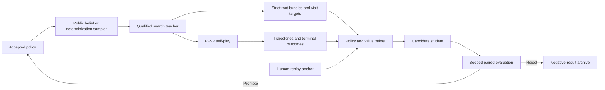

# AlphaZero-Style Research Program for Metagross

## Status

This document defines the research program for improving the accepted Metagross
r1 agent through search-guided policy and value learning. It extends the
evidence requirements in `expert_iteration_protocol.md` and replaces ad-hoc
cycles of collecting self-play, fine-tuning, and testing on the ladder.

The program is intentionally ambitious. It includes the infrastructure,
controlled experiments, learning system, search improvements, iterative
self-play loop, and evaluation methodology needed to make defensible research
claims. It does not assume that the current search, current policy, or current
training objective is the right answer.

When this document conflicts with an older experimental note, use the stricter
data, reproducibility, and evaluation requirement.

## Objective

Produce an agent that is stronger than accepted r1 in controlled head-to-head
evaluation and then establish whether that improvement transfers to the public
`gen9randombattle` ladder.

The accepted reference is:

| Component | Frozen reference |
|---|---|
| Policy | `randbats_exit_r1`, epoch 5 |
| Deployment | `foul_play_root_priors_opp` |
| Search | Root-only PUCT over Foul Play determinizations |
| Search configuration | 500 ms, parallelism 8, one search thread, `c_puct=2.0` |
| Historical ladder result | 92.4-92.7 GXE at RD 25; peak observed GXE 93.6 |

The ladder result is historical evidence, not a paired benchmark. Every new
claim must be established against the frozen r1 artifact in controlled tests
before public-ladder use.

## Scope And Terminology

This is an **AlphaZero-style** program, not a claim that Pokemon satisfies the
assumptions of canonical AlphaZero.

Pokemon is stochastic, imperfect-information, and simultaneous-action. The
current Foul Play integration searches sampled hidden worlds and uses root-only
PUCT. Canonical AlphaZero assumes a perfect-information state and alternating
actions. Search visit targets are therefore candidate policy-improvement
targets, not automatically correct labels.

The near-term system is best described as:

> Belief-sampled Expert Iteration with policy/value learning and empirical
> teacher qualification.

The longer-term target is public-belief search with regret-based treatment of
simultaneous actions, closer to ReBeL and Student of Games than literal
AlphaZero.

| Term | Meaning |
|---|---|
| Apprentice | A direct neural policy without test-time search. |
| Teacher | A search procedure proposed to improve the apprentice policy. |
| Information state | Everything legitimately observable to the acting player, including public history and the player's private team. |
| Determinization | One sampled complete hidden world consistent with the information state. |
| Root bundle | A fixed information-state record, sampled worlds, weights, priors, masks, and provenance used for matched search treatments. |
| Teacher gap | Independently measured utility difference between a search policy and its direct apprentice. |
| Transfer gap | Difference between the teacher's improvement and the amount recovered by a trained student. |
| Accepted checkpoint | The current official parent and primary promotion comparator. It is r1 initially and changes only after a candidate passes every promotion gate. |

## Research Standard

Four claims must remain separate:

1. **Search is different:** its action distribution differs from the direct
   policy.
2. **Search is stable:** repeated searches produce value-equivalent targets at
   the selected budget.
3. **Search is stronger:** independent outcomes favor search over the direct
   policy and relevant controls.
4. **Search is teachable:** training on search targets produces a stronger
   direct student than matched controls.

KL divergence, lower entropy, top-action changes, higher internal root value,
or agreement with a deeper search establish neither strength nor teachability.
A search procedure is a qualified teacher only after all four claims hold.

## Existing Evidence

The program begins from retained evidence rather than resetting the project.

### Positive Evidence

- r1 completed one ExIt-style selected-action offline-RL round and coincided
  with a historical ladder improvement over the prior project best.
- The schema-v3 round-one dataset retains 175,319 exact observation/visit
  targets, direct r1 policy probabilities, legal masks, selected actions, and
  outcome labels.
- The best schema-v3 visit-distilled candidate scored 264-235 over 499 decisive
  games, or 52.9%, against r1.
- The policy and search distributions disagree often enough to provide a
  nontrivial candidate learning signal.

### Negative And Inconclusive Evidence

- The 264-235 candidate failed promotion because its Wilson 95% lower bound was
  48.5% and one requested game was void, independently violating the retained
  complete-decision gate.
- Increasing the visit-loss coefficient regressed to 45.0% and 40.7%.
- Latest-self continuation screened 34-40 and did not compound.
- Three-second search produced about 3.9 times the visits of one-second search,
  but entropy, top mass, and KL-to-r1 proxies were materially unchanged.
- Existing learned-leaf models had reasonable offline metrics but were harmful
  when inserted into search.
- Action-conditioned belief updates improved held-out set-recovery and
  calibration metrics, but that result did not establish downstream battle
  strength.
- A corrected two-sided shared-root regret-matching candidate finished 6-18 and
  was rejected. Any follow-up must identify and change the mechanism implicated
  by that failure rather than repeat the same solver.
- Selective shared-root re-solving was implemented; its corrected formal gate
  stopped incomplete at 44-35. That result is promising but inconclusive and
  cannot be cited as a pass or failure.
- Historical opponent-prior coverage was not retained, and a later
  opponent-view adapter bug prevents causal claims about C2.
- The current evaluation harness balances challenge roles but does not replay
  identical team and random seeds.

These results reject repeating the same auxiliary-loss recipe at a larger
coefficient and repeating the rejected shared-root treatment unchanged. They do
not reject search-guided learning, dedicated policy/value training, improved
belief use, redesigned shared-root or public-belief search, or a properly
controlled iteration loop.

## Research Questions

### RQ1: Is Search A Stronger Actor?

Does r1-guided root PUCT achieve higher game value than direct r1 under matched
initial teams, roles, opponents, and ex ante randomization tapes where events
remain semantically comparable?

### RQ2: Does The Learned Prior Help Search?

At equal search effort, does r1-prior PUCT outperform equal-legal-prior PUCT?
If not, is equal-prior search itself a useful teacher?

### RQ3: What Search Budget Produces The Best Teacher?

How do strength, target stability, determinization variance, and target
diversity change with exact iteration budget?

### RQ4: Can The Student Recover The Teacher Gap?

Does a dedicated policy/value learner trained on matched visit and outcome
targets beat selected-action offline RL, self-distillation, and no-search
controls?

### RQ5: Does A Learned Value Improve Search?

Can an information-state-correct value model replace or augment the current
leaf evaluator without hidden-state leakage or distribution mismatch?

### RQ6: Are Better Beliefs More Valuable Than More Search?

Does exact conditional Random Battle generation, action-conditioned belief
updating, or learned whole-team posterior completion improve search more than
increasing visits under the existing belief sampler?

### RQ7: Can The Loop Compound?

Do promoted students continue to improve held-out strength over multiple
iterations when trained against a checkpoint pool rather than latest self only?

### RQ8: Can A More Principled Solver Beat Determinized PUCT?

Do shared information-set roots, Exp3 or regret matching at simultaneous nodes,
and public-belief re-solving reduce exploitability and increase population win
rate?

## Core Hypotheses

| ID | Hypothesis | Falsifying evidence |
|---|---|---|
| H1 | Normal-budget r1-guided search is stronger than direct r1. | A powered matched evaluation excludes the predeclared practical improvement or favors direct r1. |
| H2 | Learned priors allocate search better than equal priors. | Equal-prior PUCT is non-inferior or superior at matched iterations. |
| H3 | A finite affordable budget produces stable visit targets. | Repeated-search and determinization variance remain high at every tested budget. |
| H4 | Visit distributions carry more transferable information than the teacher's selected action alone. | Matched visit-policy students do not beat one-hot teacher-action controls across training seeds. |
| H5 | Outcome-value learning improves the policy, search, or both. | Adding the value objective fails held-out calibration and controlled H2H gates. |
| H6 | Better beliefs improve action quality. | Belief calibration improves without root-value or H2H improvement, or downstream performance regresses. |
| H7 | PFSP and retained human data each reduce latest-self collapse. | Matched PFSP and human-anchor ablations show no held-out benefit or reveal equivalent drift. |
| H8 | Public-belief and regret-based search improves robustness. | The solver adds compute without reducing exploitability proxies or improving controlled game value. |

An experiment that changes multiple hypotheses at once is exploratory. It
cannot promote a model or establish a causal result.

## Program Architecture



The program has three coupled tracks:

1. **Measurement track:** deterministic search, fixed roots, seeded paired
   games, statistics, and artifact provenance.
2. **Learning track:** schema-v3 analysis, dedicated policy/value training,
   strict self-play, human anchoring, and transfer measurement.
3. **Search track:** beliefs, leaf values, simultaneous-action solvers,
   shared-root search, and public-belief re-solving.

The tracks may proceed in parallel, but no training result can compensate for
an invalid evaluator and no search proxy can substitute for outcome evidence.

## Phase A: Reproducible Measurement System

### A1. Frozen Run Manifest

Every formal run writes its manifest before the first game or root search. The
manifest contains:

- Full command and relevant environment variables.
- Repository commit and dirty-tree diff hash.
- Foul Play, Metamon, Showdown, and engine revisions.
- Engine wheel or binary SHA-256 and enabled feature set.
- Policy checkpoint SHA-256 and model configuration.
- Search algorithm, exact iterations, `c_puct`, threads, parallelism, and
  determinization count.
- Belief sampler configuration and pool hash.
- Policy temperature and search-target temperature.
- Team, battle, search, determinization, and model-sampling seeds.
- Opponent-pool definition and schedule.
- Host CPU/GPU identity, worker isolation, and concurrency.
- Predeclared metrics, gates, and maximum sample plan.

The completed manifest adds artifact hashes, admitted and rejected counts,
void reasons, and result hashes. A changed manifest creates a different run.

### A2. Randomness Contract

Use independent, recorded random streams for:

- Random Battle team generation.
- Battle mechanics.
- Hidden-world sampling.
- Opponent-action sampling.
- MCTS selection and rollout randomness.
- Root exploration noise.
- Policy action sampling.
- Dataset sampling and network initialization.

Streams must be indexed by semantic identity rather than one process-global RNG
whose consumption changes when action paths diverge. Replaying a root or battle
with the same manifest must reproduce its initial conditions and treatment
inputs.

Once treatments choose different actions, later events may no longer be
semantically matched. Common random tapes are a variance-reduction coupling over
comparable events, not a claim that divergent games experience identical chance
outcomes. Inference averages over the declared seed distribution.

### A3. Seeded Mirrored Battles

The current `--paired` mode is role-balanced, not team-paired. Replace it with a
pair contract:

- Each pair has a stable `pair_id` and two legs.
- Leg two swaps the exact teams from leg one.
- Team and battle seeds are fixed and recorded.
- Team hashes must be exact reversals between legs.
- Challenger and acceptor roles are balanced.
- Only treatment-independent harness or server failures, classified without
  inspecting outcomes, invalidate both legs. Those pairs are rerun from their
  original manifest or excluded as complete pairs.
- A treatment-caused timeout, crash, illegal action, inference failure, or
  resource violation is scored under a predeclared loss rule and may also fail
  promotion independently.
- Legitimate ties score 0.5. Unknown winners are distinct from ties and fail the
  harness gate.

Formal reports lead with intention-to-treat results and include raw game
outcomes, complete-pair scores, role splits, team-strength splits, failure
reasons, marginal intervals, and pair-clustered intervals. Any per-protocol
analysis is secondary. Secondary Wilson summaries state explicitly whether ties
are excluded or represented as half-wins.

### A4. Deterministic MCTS

Extend the Rust and Python bindings to support:

- Exact iteration budgets.
- Explicit search seeds.
- One-thread prior-preserving PUCT.
- Explicit equal priors over legal actions.
- Per-world visit totals and root policies.
- Stable state and configuration hashes.

Wall-clock duration remains a deployment metric. It is not the primary
experimental effort variable because CPU contention changes completed visits.

### A5. Harness Qualification

Before model comparisons:

- Run accepted r1 against itself on seeded mirrored pairs.
- Predeclare an acceptable harness-bias margin and require the confidence
  interval to lie wholly inside that equivalence region around 50%.
- Require no systematic role or team bias and zero unknown outcomes.
- Verify through an equivalence test that concurrency does not materially alter
  iteration counts, treatment inputs, or scores.
- Verify that rerunning a recorded pair reproduces teams, initial state, and
  configuration.
- Test score parsing, pair invalidation, promotion-gate input, and nonzero exit
  status on gate failure.

## Phase B: Exact Existing-Data Audit

Build a strict schema-v3 analysis command over the retained round-one and
round-two datasets and their matching snapshot reports. It must consume
embedded exact observations and `policy_probs`; it must not reconstruct policy
inputs from replay trajectories. Round one embeds r1 probabilities. Round two
embeds probabilities from the 6k parent candidate, so every report must name and
hash the policy source rather than call all embedded probabilities r1.

### Validation

Reject or separately report:

- Duplicate `(battle_tag, username, decision_idx)` keys.
- Non-finite or negative visit values.
- Visit or policy distributions that fail normalization.
- Positive mass on illegal actions.
- Malformed masks or probability widths.
- Missing or conflicting outcomes.

Finalized JSONL cannot reveal skipped forced-only decisions, raw unmappable
actions, name tables, or mask-fallback provenance. Read those counts from the
matching shard/finalization reports and, where retained, raw decision logs and
prior dumps. Do not infer absent rejection categories from admitted rows.

### Metrics

Report with battle-clustered uncertainty:

- Top-1 and top-k agreement.
- Cross-entropy, KL, Jensen-Shannon divergence, and total variation.
- Policy and search entropy.
- Top-action mass and margin.
- Parent-policy probability assigned to the search action.
- Visit-policy change by battle turn and legal-action count.
- Change by switch, move, Tera, forced, and high-entropy state class.
- Change by outcome without interpreting outcome correlation causally.
- Round-one versus round-two target drift, labeled as confounded by both the
  changed parent policy and changed state occupancy unless recomputed on common
  roots with a common frozen policy.
- Per-battle and per-decision effective sample sizes.

This audit maps where the existing teacher changes behavior and defines strata
for new root collection. It does not establish action quality.

## Phase C: Same-Root Teacher Qualification

### C1. Root-Bundle Capture

For each sampled information state, capture:

- Exact prior-server observation and legal mask.
- Public battle history identity.
- Direct policy probabilities.
- Every sampled determinized state and sample weight.
- Player and modeled-opponent priors.
- Name tables and canonical action mappings.
- Search configuration and all random seeds.
- Engine and model hashes.

Only the behavior treatment may choose the live action. Shadow treatments run
on immutable copies of the same root bundle and cannot affect the battle.
Use inline shadows only for low-budget integration checks. Qualification-scale
treatments replay the frozen private roots offline so search budget cannot alter
game latency, root occupancy, or the behavior policy's action timing.

The actual hidden opponent team must never enter the bundle except in a
separately marked oracle diagnostic that is excluded from teacher generation.
Every policy and evaluator receives only that player's legitimate information
state; a completed sampled world must not leak the other player's private state
through the opponent adapter.

### C2. Required Treatments

| ID | Treatment | Question |
|---|---|---|
| `P` | Direct r1 policy | What does the apprentice do without search? |
| `U-B` | Equal-legal-prior PUCT at budget `B` | Does lookahead help without a learned prior? |
| `S-B` | r1-prior PUCT at budget `B` | Is the proposed teacher stronger and stable? |
| `S-4B` | r1-prior PUCT at four times `B` | Does deeper search improve the policy? |
| `S-B-C2` | `S-B` with measured opponent priors | Does C2 add value after adapter validation? |
| `TRUE-STATE` | True-hidden-state diagnostic | What changes when hidden state is exposed? Never a valid teacher or automatic upper bound. |

`B` is calibrated in exact iterations to the accepted deployment's completed
work on the target hardware. Test geometrically spaced budgets around it rather
than assuming more visits are better.

Uniform-prior PUCT is not stock Foul Play. It must assign equal positive mass to
every legal root action while preserving the same PUCT rule, evaluator,
determinizations, and effort.

To isolate the learned player prior, hold the side-two selection rule fixed
between `U-B` and `S-B`. The primary comparison uses equal legal side-two priors
in both treatments and changes only side one's prior from equal to r1. Opponent
prior changes belong exclusively to the separately measured C2 treatment.

### C3. Root Sampling

Define a target information-state occupancy distribution induced by a named
behavior policy and opponent population. Use held-out battles, record root
inclusion probabilities, and limit correlated roots from any one battle.
Stratify the sample by:

- Early, middle, and late game.
- Low and high policy entropy.
- Low and high belief uncertainty.
- Number and kind of legal actions.
- Move, switch, and Tera availability.
- Tactical and quiet positions.
- Common and rare Random Battle archetypes.
- Prior/search agreement and disagreement.

Development roots tune implementation and thresholds. Final roots are frozen
before treatment results are inspected. Post-stratify estimates back to the
target occupancy distribution so deliberately oversampled disagreement or rare
states do not dominate the primary result. Any disagreement stratum is defined
by a frozen pre-treatment search.

### C4. Stability Metrics

Run multiple tree seeds and determinization schedules per root and budget.
Measure:

- Pairwise Jensen-Shannon divergence and total variation.
- Top-action agreement.
- Rank correlation as a secondary diagnostic.
- Budget-to-budget divergence.
- Variance attributable to tree randomness and determinization sampling.
- Value regret between repeats once independent action values are available.

Initial target-quality requirements are:

| Metric | Requirement |
|---|---:|
| Median repeated-search JS divergence | `<= 0.05` nats |
| 90th-percentile repeated-search JS divergence | `<= 0.15` nats |
| Top-action agreement | `>= 80%` |
| Median value regret from search randomness | `<= 0.005` game score |
| 90th-percentile value regret | `<= 0.02` game score |

Distributional instability is acceptable when independently measured action
values are equivalent. Value stability takes precedence over exact visit
agreement.

Freeze counts of roots, search repeats, posterior worlds, and continuation
rollouts before final evaluation. Pass stability and value-regret requirements
with simultaneous one-sided confidence bounds, not observed medians alone. Use
nested resampling or an equivalent variance estimator over source battle, root,
posterior world, search repeat, and continuation rollout so finite inner Monte
Carlo uncertainty is represented.

### C5. Independent Action-Value Evaluation

Search cannot grade itself. For each held-out root:

1. Estimate action values for every legal player action.
2. Sample hidden worlds from the frozen acting-player posterior
   `b(h_-i | I_i)`, not the actual hidden team.
3. Sample the opponent's simultaneous action from a frozen opponent policy.
4. Reuse common random tapes across candidate player actions.
5. Resolve chance and continue with frozen policies that were not used to build
   the candidate tree.
6. Compute each treatment's expected value under the independently estimated
   action values.

Do not use the candidate tree's backed-up Q, the same rollouts that generated
visits, or an evaluator trained on the final test roots.

The primary root estimand is:

```text
Delta_root(I) = sum_a [pi_search(a|I) - pi_direct(a|I)] * Q_independent(I, a)
```

Report weighted mean improvement, median improvement, tail regret, and every
predeclared stratum. This is a one-decision policy intervention under the named
opponent and frozen continuation policies, not the value of deploying search
throughout a game. It supports no equilibrium or exploitability claim. A gain
isolated to rare states is not sufficient.

### C6. Teacher Decision

Interpret controls rather than forcing the existing search to win:

Predeclare a minimum-benefit margin, equivalence margin, and non-inferiority
margin before final roots are evaluated. A minimum-benefit claim requires the
multiplicity-adjusted lower confidence bound to exceed the practical margin,
not merely zero. Equivalence and non-inferiority require their corresponding
bounds to fall inside the declared margins; failure to find a difference is not
equivalence.

| Result | Decision |
|---|---|
| `S-B > P` and `S-B > U-B` | Learned-prior PUCT is the teacher candidate. |
| `U-B > P` and `U-B >= S-B` | Lookahead helps; use or improve the equal-prior teacher. |
| `S-4B ~= S-B` | Use the cheaper stable budget and stop scaling visits. |
| `S-4B < S-B` | Deeper search amplifies bias; investigate evaluator or beliefs. |
| Search differs from `P` but has no value gain | Do not train on those visits. |
| No treatment beats `P` | Improve search before another ExIt round. |

## Phase D: Full-Game Teacher Strength

Root proxies must be confirmed by complete games.

### D1. Direct And Search Agents

Add first-class evaluation agents for:

- Direct r1 with a frozen action temperature.
- Equal-prior PUCT.
- C1-only r1-prior PUCT.
- Corrected and measured C1+C2 PUCT.
- Candidate policy/value search.

Every agent uses the same result, timeout, logging, and manifest contract.

### D2. Matchups

The core matrix is:

| Candidate | Comparator | Claim |
|---|---|---|
| `S-B` | `P` | Search is stronger than its apprentice. |
| `U-B` | `P` | Lookahead adds value without learned priors. |
| `S-B` | `U-B` | The learned prior improves search allocation. |
| `S-4B` | `S-B` | Additional search effort improves strength. |
| `S-B-C2` | `S-B` | Opponent priors add value. |

After direct comparisons, evaluate every surviving treatment against a frozen
panel containing:

- Current accepted search deployment.
- Its direct parent policy.
- Frozen r1 search and direct r1 as permanent historical anchors after the
  first promotion.
- Base Kakuna policy and Kakuna-guided search.
- Stock Foul Play.
- Older accepted or historically important checkpoints.
- Deliberately exploitative or approximate-best-response policies when
  available.

The panel prevents a nontransitive head-to-head edge from being mistaken for
general improvement.

### D3. Strength Gate

Use complete mirrored pairs as the independent unit. The primary endpoint is a
predeclared weighted paired score difference between the candidate and parent
against the same frozen opponents, initial teams, and seeds. Direct
search-versus-apprentice H2H is a required secondary endpoint.

Assign one `evaluation_block_id` to the candidate and parent mirrored matches
that share an opponent, initial teams, and seed schedule. Cluster or resample at
this full multi-leg block rather than treating the candidate and parent pairs as
independent.

Define every deployment candidate as an exact policy, search algorithm,
resource, hardware, and per-decision latency configuration. Mechanism studies
use exact iterations; promotion against the current accepted deployment
additionally uses identical hardware and its per-decision latency contract so
extra compute is not mistaken for a model improvement.

A strong teacher candidate passes this stage only when:

- The multiplicity-adjusted lower bound for the primary weighted
  candidate-minus-parent panel contrast exceeds the predeclared practical
  improvement margin.
- The lower endpoint of a two-sided 95% confidence interval for the required
  search-minus-direct secondary contrast exceeds its predeclared margin.
- Multiplicity-adjusted non-inferiority bounds exclude a material regression in
  every protected opponent stratum.
- Role, team, and seed diagnostics show no unexplained asymmetry.
- Every result comes from complete pairs with no unexplained outcomes.
- The selected budget also passed the root stability gate.

If the confidence interval includes both zero and the practical threshold, the
result is inconclusive rather than negative. Continue only under the
predeclared sampling or confidence-sequence rule.

Passing this stage establishes empirical strength, not full teacher
qualification. The search becomes a qualified teacher only after the transfer
gate shows that students reliably absorb its gain.

## Phase E: Dedicated Policy/Value Learning

The existing auxiliary visit loss is a useful prototype, not the final trainer.
Build a dedicated trainer around the Kakuna/r1 representation.

### E1. Model

The initial architecture contains:

- The pretrained Kakuna timestep and trajectory encoders.
- One deployment policy head over the canonical 13 actions.
- One scalar value head from the acting player's point of view.
- Optional uncertainty or outcome-distribution heads as controlled ablations.
- Legal-action masking identical to the deployed prior server.

Train and export only the policy output actually consumed by deployment. Do not
broadcast targets across unused gamma heads. A no-op export must be numerically
equivalent to r1 before any trained checkpoint is evaluated.

### E2. Targets

Use:

- Search visit distributions for policy targets.
- Terminal win/loss outcome for the primary value target when it is on-policy
  for the named behavior and continuation policy.
- Shaped returns only as a separately controlled auxiliary target.
- Frozen parent probabilities for self-distillation controls, with r1 named
  separately when used as a permanent historical anchor.
- Selected replay actions for offline-RL and behavior-cloning controls.
- Human replay actions for the population anchor.

Search and outcome labels must share exact information-state identity. Outcome
labels never repair a missing or ambiguous search join. Record behavior-policy
and opponent-mixture identity on every trajectory. Shadow-search visits may
supply policy targets, but the live trajectory outcome is not an on-policy
value target for the shadow teacher without an explicit off-policy estimand or
correction. Define every value target as `V^(pi,rho)(I)` for a named continuation
policy `pi` and opponent mixture `rho`.

### E3. Objective

The general loss is:

```text
L = lambda_pi * CE(pi_search, p_student)
  + lambda_v * ValueLoss(z, v_student)
  + lambda_rl * OfflineActorCriticLoss
  + lambda_h * HumanAnchorLoss
  + lambda_kl * KL(p_student || p_reference)
  + lambda_l2 * L2
```

Each coefficient is an ablation. The first causal experiment changes only the
policy target. Value learning, human anchoring, KL regularization, and offline
actor-critic updates are added one at a time or in a predeclared factorial
design.

### E4. Same-Data Causal Arms

| Arm | Policy target | Value target | Purpose |
|---|---|---|---|
| A | Selected-action offline RL | Existing returns | Reproduce the r1-style control. |
| A-prime | One-hot action selected by the search teacher | None | Matched control isolating visits from the teacher's final action. |
| B | Frozen parent probabilities | None | Self-distillation and training-pipeline control. |
| C | Search visits | None | Isolate visit-policy information through `C - A-prime`. |
| D | Search visits | Named on-policy terminal outcome | Test the joint policy/value objective. |
| E | Equal-prior search visits | None | Same-state policy-target test of the alternative teacher if `U-B` qualifies. |

All arms share states, split, initialization seeds, optimizer budget, batch
schedule, augmentation, and evaluation opponents. Training seeds are paired
across arms.

Retained-data causal arms use the frozen intersection of schema-v3 target groups
and validated parsed trajectories whenever any compared objective requires
trajectory context. Group identity alone is insufficient: build a fail-closed
per-decision join and prove observation, legal-mask, selected-action, and order
equivalence between each parser timestep and captured schema-v3 decision before
calling the arms same-state. Report every excluded row and group. If exact
equivalence cannot be established, label the result same-battle rather than
same-state. Stateless arms may use the larger target-only set in a separate
scaling experiment, but not in the same-data causal comparison.

An equal-prior policy/value arm requires separate trajectories in which `U-B`
actually chooses live actions. It is a separate-data experiment and cannot be
presented as part of the same-state causal comparison with `S-B` behavior.

### E5. Splits And Leakage Prevention

- Split by battle, never by decision row.
- Keep collection generation, opponent, and seed groups intact.
- Maintain development, validation, and final held-out battles.
- Keep formal H2H teams, roots, and opponent seeds out of training.
- Hash and freeze every split before training.
- Report performance by collection generation and opponent, not only aggregate
  loss.

### E6. Offline Evaluation

Track:

- Visit-policy cross-entropy and KL.
- Top-action agreement.
- Outcome log loss, Brier score, calibration, and reliability curves.
- Value error by turn and belief uncertainty.
- Human replay action agreement.
- Policy entropy and drift from r1.
- Effective sample size under every weighting scheme.

Offline metrics select checkpoints only under a predeclared rule. They never
promote a model.

### E7. Transfer Gate

Evaluate students without search first. A teacher is teachable only if the
visit-trained direct student beats matched controls on held-out roots and the
frozen opponent panel.

The teachability estimand is the mean paired arm difference across independently
trained seeds under one predeclared checkpoint-selection rule per seed.
Training seed is the top-level inferential unit; mirrored game pairs quantify
evaluation noise within each seed. Determine the number of seeds from a
predeclared precision or power calculation, retain every seed, and never report
only the best checkpoint seed.

The primary teachability contrast is Arm C minus Arm A-prime on the frozen
opponent-panel utility: visit distributions versus the same teacher's one-hot
selected action. Before training, declare a practical transfer margin and a
single multiplicity family covering all controls and endpoints. The teacher
qualifies only if the multiplicity-adjusted lower confidence bound for the
seed-level primary contrast exceeds that margin. Arm C versus self-distillation
Arm B, r1-style Arm A, and held-out fixed-root value are protected secondary
contrasts with predeclared superiority or non-inferiority margins. Failure on a
protected safety contrast blocks qualification; unplanned contrasts remain
exploratory.

Report:

```text
teacher gap  = score(search teacher) - score(direct parent)
student gain = score(direct student) - score(direct parent)
recovery     = student gain / teacher gap
```

Define all three terms on the same frozen panel utility and evaluation
distribution. Treat recovery as descriptive because the ratio is unstable when
the teacher gap is small; report numerator and denominator first and use a joint
bootstrap or Fieller interval when reporting the ratio. Promotion never gates
on recovery alone.

Then place each surviving student back inside identical search. This separates
direct policy improvement from policy/search interaction.

## Phase F: Strict Self-Play And Iteration

### F1. Data Contract

Every admitted battle must satisfy:

- Required player priors succeeded at every decision.
- C2 coverage is measured and never inferred from an agent name.
- One raw battle identity produces exactly two distinguishable POV
  trajectories when both sides are retained.
- Exact observation, mask, name table, visits, selected action, and result join
  by stable identity.
- Every visit is finite, nonnegative, legal, and normalized.
- Every mask is explicit; fallback masks are rejected.
- Raw protocol, strict root bundles, parsed trajectories, and manifests remain
  available for later reanalysis.
- Battle counts, replay files, POV trajectories, and decision rows are reported
  as separate quantities.

Training-data admission is distinct from evaluation scoring. A battle with a
treatment-caused failure may be rejected from training while still counting as
a predeclared loss in intention-to-treat evaluation.

### F2. Opponent Population

Latest-self-only collection is prohibited for official rounds. Use a versioned
PFSP population containing:

- Accepted r1.
- The current promoted student.
- Base Kakuna and Kakuna-guided search.
- Stock Foul Play.
- Older promoted checkpoints.
- Diverse exploitative or counter-strategy agents.

Favor opponents producing approximately even matchups while preserving a
minimum quota for every population member. Keep a held-out opponent panel that
never contributes training trajectories.

Test population sampling and human anchoring causally in a development-only
factorial or matched sequential ablations:

| Population | Human anchor |
|---|---|
| Latest self | None |
| Latest self | Fixed anchor |
| PFSP pool | None |
| PFSP pool | Fixed anchor |

Unsafe arms never enter the official lineage, but they are evaluated under the
same held-out panel so PFSP and human anchoring receive separate evidence.

### F3. Exploration

After teacher qualification, test AlphaZero-style exploration as separate
factors:

- Root Dirichlet noise applied once per information-state decision, shared
  across determinizations.
- Early-game visit-temperature sampling with a predeclared annealing schedule.
- Determinization diversity and posterior tempering.
- Policy-temperature exploration.
- Novelty or uncertainty-based root sampling.

Strength evaluation uses no exploration noise unless evaluating the exact
stochastic teacher distribution intended for training.

### F4. Replay Window

Maintain a versioned replay window containing:

- Current strict generation.
- Selected promoted historical generations.
- A fixed human anchor.
- Explicitly weighted legacy r1 data.
- No failed, fallback, or ambiguous shards.

Compare fixed-window, recency-weighted, and reservoir strategies. Never relabel
legacy selected-action data as visit-target data.

### F5. Iteration

For each generation:

1. Freeze the accepted generator and opponent population.
2. Generate strict root bundles, trajectories, and outcomes.
3. Validate and hash the complete dataset.
4. Train matched causal arms.
5. Evaluate direct students.
6. Evaluate students inside frozen search.
7. Run the external opponent panel.
8. Promote at most one checkpoint under the declared rule.
9. Add only the promoted checkpoint to the official lineage.
10. Archive every failed candidate and negative result.

No candidate generates the next official round before promotion.

## Phase G: Search Research Frontier

The following tracks are required when empirical teacher qualification exposes
a search ceiling. They may also run in parallel on held-out branches.

### G1. Information-State-Correct Values

Previous learned leaves failed partly because serialized search states omitted
unrevealed opponents or produced biased labels. A replacement must:

- Consume public information and the acting player's legitimate private state.
- Integrate over the acting-player posterior rather than inspect the actual
  hidden world.
- Train on terminal outcomes or counterfactual labels with strict provenance.
- Validate calibration under the exact search-time distribution.
- Compare leaf replacement, residual blending, and uncertainty-gated use.
- Fail closed when posterior completion is invalid.

The r1 continuation bridge must use dual state. A sampled `poke_engine.State`
is the mechanical simulator state and remains coordinator-private. A separate
player-information tracker starts from the exact captured schema-v3 observation
and player protocol prefix, then advances only from an observer-specific public
event stream. A direct `poke_engine.State -> r1 observation` conversion is
forbidden because sampled states contain private opponent sets and no longer
retain reveal provenance.

Raw engine `Instruction` values are also forbidden as policy observations. They
are omniscient state mutations, can contain hidden-set-dependent bookkeeping,
and do not preserve semantic action, miss, failure, or critical-hit boundaries.
The experimental `step_with_uniform_debug` API may expose the selected raw
branch only for differential tests. A qualifying event projector must prove
hidden-world noninterference, POV masking, public HP semantics, executed-action
semantics, and root/one-step probability parity before r1 continuation values
are admitted.

#### G1.1 Certified Switch Projection

`r1-switch-v1` is the first observer-specific event certificate. It admits only
quiet voluntary double switches and quiet post-faint replacement switches. Every
sampled world must satisfy the same public preconditions and strict selected-
instruction grammar; one unsupported instruction or mechanical delta rejects the
entire information-set transition. The binding must report the pinned diagnostic
contract `poke-engine-0.0.47-r1-switch-v1`; absent or different contracts fail
before any world is inspected. Accepted events expose only actor, displayed
species, public level, player-legitimate or public HP fraction, public status,
and prior-reveal status. Branch index/probability, engine slots, exact opponent
HP, hidden sets, and raw instructions never enter the player tracker.

The root snapshot now retains a serialized player-information state plus mutable
observation history at the player-inference and post-opponent-inference
boundaries. `R1SwitchTracker` reconstructs this state, proves exact root token and
numeric parity, applies the masked switch event, and independently reconstructs
the next legality mask and action table. Unknown opponent trapping abilities,
Illusion, Assault Vest, entry effects, hazards, weather, terrain, Trick Room,
volatiles, boosts, tera, and every move turn fail closed.

A controlled Showdown-protocol differential test proves exact next
`text_tokens`, `numbers`, `illegal_actions`, `name_table`, and frozen-checkpoint
probabilities for a quiet double switch. Hidden-world metamorphic tests vary
unrevealed moves and conditional engine bookkeeping while requiring byte-equal
public events. This is a one-step certificate, not a terminating continuation
policy. Formal values remain blocked until move/action/outcome semantic tracing
is implemented and certified.

#### G1.2 Certified Basic-Move Projection

`r1-basic-move-v1` extends the one-step bridge to a deliberately narrow move
subset. The engine records an action only after all cannot-act branches have
been removed, and the binding emits ordered executed-action, HP, major-status,
and boost events under the pinned contract
`poke-engine-0.0.47-r1-basic-move-v1`. PP and last-move bookkeeping advance the
coordinator-private mechanical state but do not become public events; the
observer's own exact HP, status, PP, and disabled flags advance through a
separate legitimate-private delta. Every other instruction kind rejects the
whole information-set transition.

Admission currently requires a quiet, non-Tera prestate whose active Pokemon
have no item, ability, or status, plus an explicit whitelist of simple damage,
fixed-damage, recovery, major-status, and self-boost moves. For a common uniform
draw, sampled worlds are partitioned by authorized public events and the own-
private delta. Worlds with identical observations merge; differences such as
displayed opponent HP form separate observation classes without exposing the
hidden stat or branch probability that caused them.

A controlled two-sided Seismic Toss differential proves exact next
`text_tokens`, `numbers`, `illegal_actions`, `name_table`, and frozen-checkpoint
probabilities against Showdown protocol plus the next private request. A hidden-
Defense metamorphic test proves merge/partition behavior at the information-set
boundary. This remains a one-step certificate. It does not certify normal
random-battle items or abilities, misses/failures, immunities, reveal causes,
residuals, multi-hit moves, pivots, hazards, weather, terrain, volatiles, Tera,
or complex forced switches, so formal terminating r1 values remain blocked.

#### G1.3 Private Admission Census

Mechanic expansion must be ordered by aggregate coverage rather than anecdotal
examples. `r1_basic_move_admission_census.py` reads private schema-v3 sampled
states, enumerates legal actions with the pinned engine, and reports only fixed
overlapping blocker categories and fixed certificate outcomes. Root weights,
schedules, captured world weights, legal joint actions, and branch uniforms have
explicit reductions. The report must not emit root identities, action or move
names, sampled states or hashes, event rows, or exception details. It pins the
capture, source manifest, engine binding, census implementation, and event-
projector hashes, self-hashes, and is stored at mode `0600`.

The first 10-root census found zero currently eligible trials. Active item and
ability presence each covered 100% of weighted legal joint actions, existing
public boosts covered 90%, unlisted moves 64.39%, switch actions 54.95%, Tera
actions 40.59%, forced/pivot state 20%, and existing Tera/type change 10%.
Therefore item/ability activation and reveal semantics are the next universal
bridge requirement, followed by preserved public boosts, broader moves, mixed
move/switch turns, and Tera. These are descriptive overlapping rates, not
isolated counterfactual gains or action-value evidence.

#### G1.4 Certified Silent Item/Ability Presence

Generic engine HP, status, and boost instructions do not retain whether an item,
ability, move, or residual caused them. Item/ability presence therefore cannot
be admitted generally until public cause attribution survives stochastic branch
construction. `r1-silent-mechanics-v1` is a separate narrow certificate for one
audited non-activating subset: side-one Calm Mind with
Leftovers/Protosynthesis against side-two Bulk Up with Leftovers/Sap Sipper.
Existing public boosts may be present. All other field, side-condition,
volatile, status, Tera/type-change, forced/pivot, action, and semantic gates
remain fail-closed.

The semantic event grammar is exactly two executed moves plus Calm Mind's two
+1 boosts and Bulk Up's two +1 boosts. Any HP event, status event, different or
missing boost, missing action, unaccounted instruction, or extra semantic event
is an unsupported mechanic activation. No item or ability identity is copied
from a sampled world into the player-information tracker. A controlled
Showdown/request differential proves exact token, numeric, mask, action-table,
and frozen-policy parity while the hidden opponent item and ability remain
unknown; a Leftovers-healing variant rejects.

On the first private capture, this raised weighted world/joint-action admission
from zero to 0.0641% and strict information-set admission to 0.0962%. This is
useful nonzero coverage but remains far below what is required for continuation
values. The next certificate requires engine-side public mechanic-activation
markers with branch-local cause attribution.

#### G1.5 Certified Direct Leftovers Activation

The first causal trace extension is `RecordItemActivation`, a trace-only no-op
instruction that preserves the engine's six-byte instruction-size invariant and
does not appear in ordinary search instructions. For direct Leftovers healing it
is inserted immediately before `Heal` only when healing occurs. The semantic
binding exposes the fixed contract
`poke-engine-0.0.47-r1-item-activation-v1` and emits a resolved
`item_activated` event with actor, active slot, and item identity.

`r1-leftovers-activation-v1` accepts this event only as an ordered
`(Leftovers activation, same-actor HP)` suffix after the exact certified Calm
Mind/Bulk Up move-and-boost grammar. At most one suffix pair per actor is
allowed. The player-information tracker records the public item reveal and
current item token, then applies the displayed HP update. No hidden ability is
revealed by association.

A controlled Metamon protocol differential proves exact observation, legality,
action-table, and frozen-policy parity for an opponent healing from 50/100 to
56/100 through `[from] item: Leftovers`; the item changes from unknown to
Leftovers while the ability remains unknown. Coverage on the retained smoke is
unchanged because its otherwise eligible states were at full HP. This certificate
does not authorize arbitrary healing or residual attribution. Rough Skin and
Iron Barbs are the next direct candidates; secondary-injected mechanics require
branch-local secondary source metadata first.

#### G1.6 Declarative Self-Boost Registry

To avoid one-off move certificates, `r1-declarative-boosts-v1` defines the
expected public boost multiset for Agility, Bulk Up, Calm Mind, Nasty Plot, and
Swords Dance. Item/ability-bearing states and existing public boosts are admitted
only when both actions are registered and the semantic trace exactly matches the
two selected moves plus their declared boosts, optionally followed by certified
Leftovers activation/HP pairs. Contrary, Speed Boost, consumables, missing boosts
at caps, or any other extra mechanic reject automatically rather than requiring
identity-specific negative lists.

Hidden mechanically silent item/ability identities do not enter events and may
merge across worlds; publicly different action order or outcomes form separate
observation classes. A controlled Calm Mind/Nasty Plot differential proves exact
player-information observation, legality, and action-table parity. On the first
capture this increased weighted world/action admission from 0.0641% to 0.2156%
with no semantic failures, but strict information-set admission remained 0.0962%.

The next coverage-driven target is an atomic mixed self-boost/opponent-switch
transition. Common opponent switches occur across materially more strict action
mass than the current boost pairs, while the leading damaging alternative is
entangled with Toxic Chain and several item causes. Mechanic work should continue
in measured coverage order rather than by species or item catalog order.

#### G1.7 Sequential Coverage And Dual-Snapshot Gate

The completed one-step bridge, including certified next legality and boosted
voluntary double switches, reached 10.5064% weighted strict admission. A
preregistered two-transition smoke then sampled frozen r1 actions against a
declared uniform-common-legal opponent. Only 2.5% of entering mass survived one
certified transition and none survived the second. This is descriptive
certificate coverage, not a value or strength estimate, and it does not permit
continuation values.

A two-sided r1 estimand additionally requires both clients' legitimate private
information states at the same public boundary. Every new private policy
snapshot therefore records the acting `player_role` and the publicly known
opponent username. `audit_dual_r1_policy_snapshots.py` joins two distinct private
decision dumps only when schema, legality, role, private-request ownership,
reciprocal identities, battle turn, and canonical public protocol prefix all
agree. Canonicalization removes request and room/timer transport messages and
maps observer-exact HP to Showdown's Gen 7+ shared display rule for switch, drag,
damage, and heal events: ceiling percentage with non-full values capped at 99.
One-sided requests are accepted only when the private request proves a forced
switch; every unexplained singleton remains a failure. The auditor emits fixed
aggregate counts only, self-hashes its report, and writes at mode `0600`.
Passing this audit proves capture joinability only; opponent-r1 continuation and
terminal values remain forbidden until both POV trackers advance under certified
events and a terminating policy rule is preregistered and validated.

#### G1.8 Dual-Tracker Actual-Mechanical-Root Coverage

`r1_dual_tracker_parity_probe.py` measures a narrower valid two-sided estimand
without coupling independent hidden-world samples. At each joined ordinary root,
it proves that every captured world preserves the acting client's own mechanical
side, then fuses p1's actual own side and p2's actual own side under the global
orientation `SideOne=p1, SideTwo=p2`. Public mechanical globals must agree.
Search-only threat/scout annotations are reset to neutral and are excluded from
the estimand. Neither client's sampled opponent side enters the fused root, so
this is actual-mechanical-root parity rather than a joint-belief distribution.

Both player-information trackers reconstruct their own root observations and
frozen r1 probabilities. A SHA-256 tape samples both complete request policies
and one shared chance coordinate. The same fused state and joint action are
projected from both observer sides; admitted trials require identical next
mechanical state, canonical public event multisets, tracker application, exact
next legality, valid next policy distributions, and terminal inversion. Reports
contain fixed aggregate categories only, enforce count/mass equivalence, record
runtime and peak RSS, self-hash, and remain mode `0600` with continuation values
forbidden.

The first real dual-root capture joined 29 ordinary roots and excluded 11
private-request-proven forced boundaries. Every fused root, tracker, root policy,
and root action table passed. However all 116 preregistered r1-versus-r1 trials
and all 928 independently seeded replication trials failed both semantic
projectors. The fixed diagnostic split on the preregistered run was 57.8%
unsupported public prestate, 40.5% unsupported action pair, and 1.7% unsupported
engine delta. No trial reached public-outcome, next-legality, next-policy, or
terminal parity because semantic coverage was zero.

This result blocks the continuation-value branch on coverage, not infrastructure
correctness. Do not add formal r1 leaf values or expand mechanics piecemeal from
this evidence. Resume only with a preregistered mechanism expected to change a
large measured blocker class, followed by a fresh representative dual-root gate.

### G2. Belief Modeling

Build on the completed action-conditioned calibration work and develop
increasingly expressive beliefs:

1. Exact conditional Random Battle generator filtering.
2. Whole-team particle posteriors that preserve team correlations.
3. Action-conditioned Bayesian updates using a frozen opponent policy.
4. Learned posterior proposals over sets and complete teams.
5. Calibration correction and posterior tempering.

For controlled Random Battle data, evaluate against server-side generated
complete-team ground truth retained behind an evaluation firewall. If only
eventual replay reveals are available, report reveal propensity and missingness
sensitivity because revealed sets are not missing at random. Use log loss,
Brier score, coverage, calibration, and whole-team consistency, then measure
downstream root value and H2H impact with search held fixed.

### G3. Simultaneous-Action Search

Ordinary UCT or independent greedy action selection can be exploitable at
simultaneous nodes. Implement and test:

- Exp3 action selection.
- Regret matching and regret-matching-plus.
- Matrix-game solving at selected roots.
- Double-oracle action expansion when action spaces grow.
- Restricted-response controls for population exploitation.

Validate each solver on matching pennies, rock-paper-scissors, Goofspiel-like
games, and small exactly solvable stochastic games before Pokemon evaluation.
Claims about equilibrium or exploitability are limited to exactly solved
abstractions or a declared approximate-best-response procedure. Exp3 or regret
matching inside determinized Pokemon search does not inherit guarantees proved
for finite perfect-information simultaneous-move games.

### G4. Shared Information-Set Roots

The first corrected two-sided shared-root regret-matching treatment was rejected
at 6-18. Follow-ups must explain that failure through solver dynamics, belief
weighting, value bias, or compute allocation. Replace independent world-level
policies with a redesigned shared decision policy over an information set and
compare:

- Weighted aggregation of independent world searches.
- Shared-root PUCT.
- Shared-root Exp3 or regret matching.
- Belief-weighted public-tree search.
- Selective shared-root re-solving only in high-value-of-information states.

The same root action must apply across worlds the player cannot distinguish.
This prevents strategy-fusion behavior from being hidden by aggregation.

### G5. Public-Belief Re-Solving

The long-term solver operates over public states and beliefs:

- Maintain a public belief over complete private states.
- Estimate counterfactual values for both players.
- Re-solve the current public subgame with regret minimization.
- Train value and policy networks from solved public-belief states.
- Measure exploitability in reduced exact games before scaling.

This track draws from ReBeL and Student of Games. It is the principled route
when determinized PUCT reaches an empirical ceiling.

A public belief here means common knowledge over private histories at a public
state. Each player's strategy remains conditioned on that player's private
information. It is distinct from the acting-player posterior used by the
near-term determinization collector.

### G6. Endgame And Selective Solving

Selective shared-root re-solving is already implemented and its corrected gate
ended incomplete at 44-35. Preserve that evidence and resume only with a frozen
trigger, complete powered gate, and equal-average-compute control. Pokemon
hidden information shrinks as sets are revealed. Detect states where:

- Team uncertainty is low.
- Remaining action spaces are small.
- Terminal depth is short.
- Search treatments disagree with high value variance.

Apply deeper or exact solving selectively and train a gating model from measured
value of computation. Compare against equal-average-compute controls.

## Evaluation And Promotion

### Evaluation Layers

| Layer | Purpose | Promotion authority |
|---|---|---|
| Unit and property tests | Correctness and reproducibility | None |
| Offline policy/value metrics | Debugging and checkpoint selection | None |
| Fixed-root independent value | Teacher and mechanism evidence | Teacher-candidate screening only |
| Seeded mirrored H2H | Primary controlled strength estimate | Required |
| Frozen external opponent panel | Robustness and nontransitivity | Required |
| Public ladder | Current population characterization | Secondary confirmation |

### Statistical Plan

- Use battle pair, source battle, or training seed as the independent unit.
- Use full evaluation-block clustered bootstrap intervals for mirrored and
  panel games.
- Retain the legacy two-sided 95% Wilson lower-bound gate as an additional
  conservative requirement, not merely a descriptive summary.
- Use hierarchical bootstrap over battles and roots for fixed-state metrics.
- Pair network initialization and data-order seeds across training arms.
- Correct secondary budget, opponent, and stratum comparisons for multiplicity.
- Predeclare maximum samples or use a valid confidence-sequence design.
- Never stop on an ordinary confidence interval after repeatedly inspecting it.
- Allocate program-level alpha or e-value wealth across every confirmatory test,
  checkpoint, generation, and replication. Independent replication is an
  additional gate, not an alternative to repeated-testing control.
- Use concealed fresh roots, teams, and seeds for each formal promotion attempt.
  Previous formal outcomes may guide development but cannot remain
  confirmatory data.
- Report effect sizes and intervals, not only p-values.

### Candidate Promotion

A candidate replaces the current accepted checkpoint only when:

1. Reproducibility and scorer gates pass.
2. The exact candidate policy, search, hardware, and latency configuration is
   frozen before evaluation.
3. Candidate-versus-parent seeded mirrored H2H passes both the predeclared
   evaluation-block clustered improvement bound and the legacy-compatible
   two-sided 95% Wilson lower-bound-above-50% gate. For the conservative Wilson
   gate, every requested game receives a binary classification and legitimate
   ties or candidate-attributable failures count as candidate non-wins.
4. Multiplicity-adjusted non-inferiority bounds exclude every predeclared
   material regression on the frozen external opponent panel.
5. Direct-policy, search-policy, role, team, and seed diagnostics are reported.
6. Intention-to-treat scoring contains no unknown winner or identity mismatch;
   every treatment-caused failure is included under the declared rule.
7. The checkpoint, trainer, dataset, split, engine, and result manifests are
   immutable and hashed.
8. A bounded fresh-account ladder run characterizes current population
   performance before a new historical-best claim. Historical-r1 transfer is
   not inferred from a candidate-only account under a drifting ladder.

For the first generation the parent is r1. Thereafter the primary comparator is
the current accepted deployment; frozen r1 remains a permanent secondary
anchor. Where operationally possible, interleave parent and candidate ladder
accounts over predeclared time blocks, game caps, stopping rules, and rating
estimands. Even then, controlled H2H remains the primary improvement claim.

A positive point estimate without the confidence gate is promising evidence,
not promotion. A candidate that fails remains available for analysis but cannot
seed the official lineage.

## Decision And Pivot Rules

Ambition means pursuing the strongest supported direction, not protecting the
initial hypothesis.

| Evidence | Pivot |
|---|---|
| Equal-prior search beats learned-prior search | Improve or remove the learned prior; retain search as the teacher candidate. |
| Search is unstable across determinizations | Improve belief sampling or use shared information-set/public-belief search. |
| Search is stable but not stronger | Improve evaluator, solver, or opponent model before training. |
| Search is stronger but students do not improve | Redesign targets, trainer, architecture, or replay weighting. |
| Direct student improves but search does not | Promote only after full controlled evaluation; investigate policy/search interaction. |
| Value model calibrates offline but hurts search | Treat search-distribution mismatch as the failure and reject integration. |
| PFSP improves held-out strength but hurts human opponents | Increase or redesign the human/population anchor. |
| Multiple generations fail to compound | Move effort from more self-play to beliefs, values, or solver research. |

Negative results are first-class outputs. Record enough evidence to prevent the
same failed path from being repeated under a new name.

## Threats To Validity

Every report must address:

- **Strategy fusion:** determinized search may choose incompatible actions in
  hidden states the player cannot distinguish.
- **Nonlocality:** decisions in imperfect-information games depend on policies
  across the game, not only the current sampled state.
- **Belief misspecification:** search may improve the wrong posterior game.
- **Simultaneous-action exploitability:** independent action selection may miss
  strategically necessary mixtures.
- **Evaluator circularity:** search's own Q or leaf evaluator cannot validate
  the policy it generated.
- **Selection bias:** choosing checkpoints, roots, or budgets after viewing final
  outcomes invalidates nominal intervals.
- **Nontransitivity:** beating r1 directly may hide regressions against the
  broader population.
- **Role and team bias:** challenge role and Random Battle team strength can
  produce false gains.
- **Correlated samples:** decisions from one battle and mirrored games are not
  independent observations.
- **Compute confounding:** wall-clock search under contention does not imply
  equal simulations.
- **Training leakage:** roots, teams, opponents, or outcomes used for selection
  cannot reappear in final evaluation.
- **Ladder drift:** public population and metagame change over time.

## Artifact And Publication Contract

Every completed experiment publishes or archives:

- Research question and hypothesis identifier.
- Pre-registered manifest and treatment definition.
- Code and dependency revisions.
- Dataset, split, checkpoint, engine, and result hashes.
- Admission and rejection report.
- Full aggregate and stratified metrics.
- Confidence intervals and independent-unit definition.
- Resource and simulation counts without using cost as evidence of quality.
- Known deviations from the protocol.
- Promotion, rejection, or inconclusive decision.
- Machine-readable result JSON.
- Human-readable report.

Every promoted checkpoint adds a model card covering architecture, training
data, objectives, search configuration, direct-policy strength, search strength,
opponent-panel results, ladder result, limitations, and intended use.

The final research write-up should publish failed coefficients, failed leaves,
unstable search budgets, and non-promoted generations alongside successful
results. The contribution is the measured system and its evidence, not only the
best number.

## Implementation Map

The intended code organization is:

| Path | Responsibility |
|---|---|
| `src/scripts/analyze_mcts_v3_teacher_gap.py` | Strict existing-data census and clustered metrics. |
| `src/scripts/teacher_root_bundle.py` and `src/scripts/run_foul_play.py` | Capture-only immutable private roots with behavior-preserving replicated determinization schedules. |
| `src/scripts/evaluate_teacher_root_bundles.py` | Seeded offline treatment replay on frozen sampled roots. |
| `src/scripts/analyze_teacher_roots.py` | Strict repeat, schedule, budget, post-stratification, and optional independent-value analysis. |
| `src/scripts/calibrate_teacher_iterations.py` | Hardware-specific P8 duration-to-exact-iteration calibration. |
| `src/scripts/select_teacher_root_panel.py` | Deterministic stratified development/final panel selection with inclusion weights. |
| `src/scripts/collect_independent_action_values.py` | Common-tape independent values under an explicitly frozen continuation policy; the current implemented arm is uniform-legal, not r1 continuation. |
| `src/scripts/verify_r1_policy_snapshots.py` | Fail-closed checkpoint-backed parity for direct or capture-embedded schema-v3 r1 policy snapshots. |
| `src/scripts/r1_public_events.py` | `r1-switch-v1` and `r1-basic-move-v1` information-set projectors and dual player-information tracker. |
| `src/scripts/r1_basic_move_admission_census.py` | Aggregate-only private coverage census for ordering fail-closed semantic expansion. |
| `src/scripts/audit_dual_r1_policy_snapshots.py` | Aggregate-only reciprocal dual-client snapshot and forced-boundary join audit. |
| `src/scripts/r1_sequential_policy_coverage_probe.py` | One-sided finite-horizon policy-weighted certificate coverage. |
| `src/scripts/r1_dual_tracker_parity_probe.py` | Fused actual-own-side dual-tracker root parity, one-transition coverage, privacy, and performance measurement. |
| `engine/pe_v3_learned_priors/.../step_with_uniform_debug` | Omniscient selected-branch diagnostics for event-projector development; never a policy or belief input. |
| `engine/pe_v3_learned_priors/.../step_with_uniform_r1_semantic` | Pinned ordered semantic trace for certified public-event projection; raw mechanics remain coordinator-private. |
| `src/eval/run.py` | Direct policy, equal-prior PUCT, seeded mirrored pairs, and manifests. |
| `src/train/alpha_zero_trainer.py` | Dedicated policy/value learning and matched causal arms. |
| `src/scripts/finalize_alpha_zero_dataset.py` | Strict dataset validation, grouping, splits, and hashes. |
| `src/search/` | Shared-root, regret-based, and public-belief solvers. |
| `runs/alpha_zero_*/` | Append-only manifests, reports, decisions, and negative results. |

Names may change during implementation, but the contracts and separation of
responsibilities remain.

## Execution Order

1. Implement the frozen manifest, RNG, exact-iteration, and paired-evaluation
   contracts.
2. Run the exact schema-v3 census and freeze root-sampling strata.
3. Build and validate same-root treatment collection.
4. Qualify direct, equal-prior, and learned-prior search treatments.
5. Establish full-game teacher strength on seeded mirrored pairs and the frozen
   opponent panel.
6. Build the dedicated policy/value trainer and run same-data causal arms.
7. Measure teacher transfer in direct students and students inside search.
8. Add controlled exploration and strict PFSP collection.
9. Run promotion-gated iterations against the checkpoint population.
10. In parallel, advance beliefs, information-state values,
    simultaneous-action solvers, shared roots, and public-belief re-solving.
11. Promote only on controlled evidence, then perform bounded ladder
    confirmation.
12. Publish the full lineage, negative results, and reproducible artifacts.

## Primary References

- Anthony, Tian, and Barber, *Thinking Fast and Slow with Deep Learning and Tree
  Search*, https://arxiv.org/abs/1705.08439.
- Silver et al., *Mastering Chess and Shogi by Self-Play with a General
  Reinforcement Learning Algorithm*, https://arxiv.org/abs/1712.01815.
- Silver et al., *A General Reinforcement Learning Algorithm that Masters Chess,
  Shogi, and Go through Self-Play*,
  https://www.science.org/doi/10.1126/science.aar6404.
- Grill et al., *Monte-Carlo Tree Search as Regularized Policy Optimization*,
  https://proceedings.mlr.press/v119/grill20a.html.
- Cowling, Powley, and Whitehouse, *Information Set Monte Carlo Tree Search*,
  https://eprints.whiterose.ac.uk/id/eprint/75048/1/CowlingPowleyWhitehouse2012.pdf.
- Lisý et al., *Convergence of Monte Carlo Tree Search in Simultaneous Move
  Games*,
  https://proceedings.neurips.cc/paper/2013/hash/1579779b98ce9edb98dd85606f2c119d-Abstract.html.
- Brown et al., *Combining Deep Reinforcement Learning and Search for
  Imperfect-Information Games*,
  https://proceedings.neurips.cc/paper/2020/hash/c61f571dbd2fb949d3fe5ae1608dd48b-Abstract.html.
- Schmid et al., *Student of Games: A Unified Learning Algorithm for Both
  Perfect and Imperfect Information Games*, https://arxiv.org/abs/2112.03178.
- Vinyals et al., *Grandmaster Level in StarCraft II Using Multi-Agent
  Reinforcement Learning*, https://www.nature.com/articles/s41586-019-1724-z.
- Jacob et al., *Modeling Strong and Human-Like Gameplay with KL-Regularized
  Search*, https://arxiv.org/abs/2112.07544 and
  https://proceedings.mlr.press/v162/jacob22a.html.
- Schrittwieser et al., *Online and Offline Reinforcement Learning by Planning
  with a Learned Model*, https://arxiv.org/abs/2104.06294.
- Metamon, https://github.com/UT-Austin-RPL/metamon.
- Foul Play, https://github.com/pmariglia/foul-play.
- poke-engine, https://github.com/pmariglia/poke-engine.
